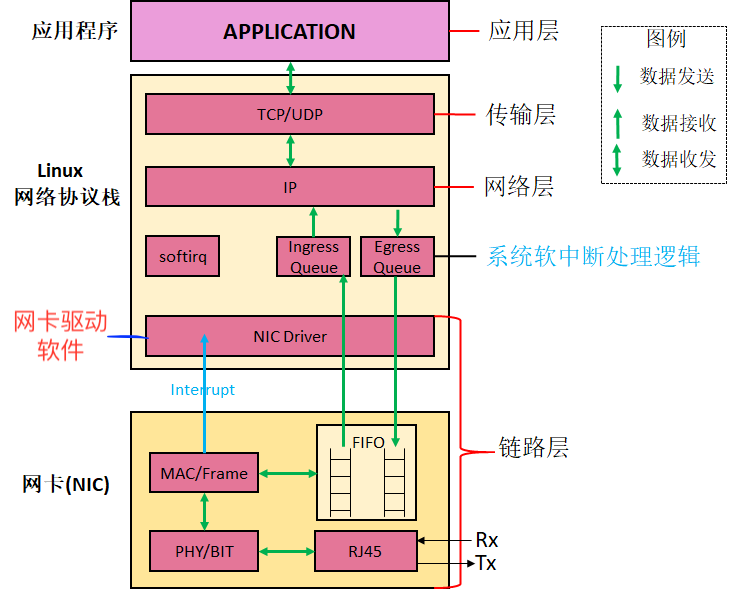
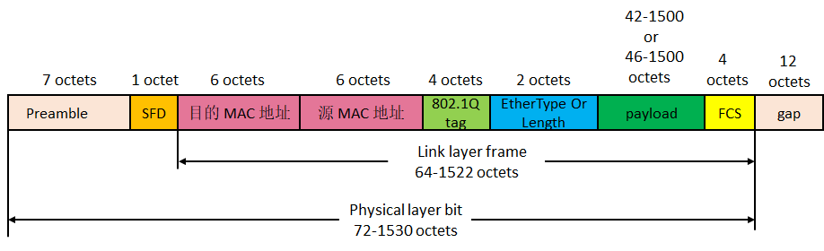

数据链入层 [源](https://www.imooc.com/read/80/article/2093)
========

* 链路层是工作在网卡和驱动程序

* Linux 内核协议

	* TCP/UDP 是传输层协议实现。对应了 TCP/IP 模型中的传输层；

	* IP 是网络层相关协议实现。对应了 TCP/IP 模型中的网络层；

	* softirq、Ingress Queue、Egress Queue 属于系统软中断层面的逻辑，和具体实现相关的逻辑；

	* NIC Driver 是网卡驱动，响应网卡硬件中断，进行数据读写。对应了 TCP/IP 模型中的链路层，属于软件实现部分。

* 网卡

	* MAC 芯片：进行帧（Frame）的封装和解封装。设置目的 MAC 地址和源 MAC 地址等。设置 FCS 检验字段；
	* FIFO：网卡内部针对数据收发有一个先进先出的队列；
	* PHY 芯片：和帧无关，只是把数据流 bit 转换成光电信号；
	* RJ45 接口：就是普通网线接口

以太网帧格式
=====
	
* 网卡驱动做一部分的数据解析
* 网卡MAC 芯片 负责帧的封装和解封装。
	* (Link Layer Frame) 对应封装
	* 目标MAC 和 自己的MAC 地址
	* FCS 是一个 CRC 校验码
* 网卡PHY 是负责 bit 数据转换成光电信号 (Physical layer bit)

