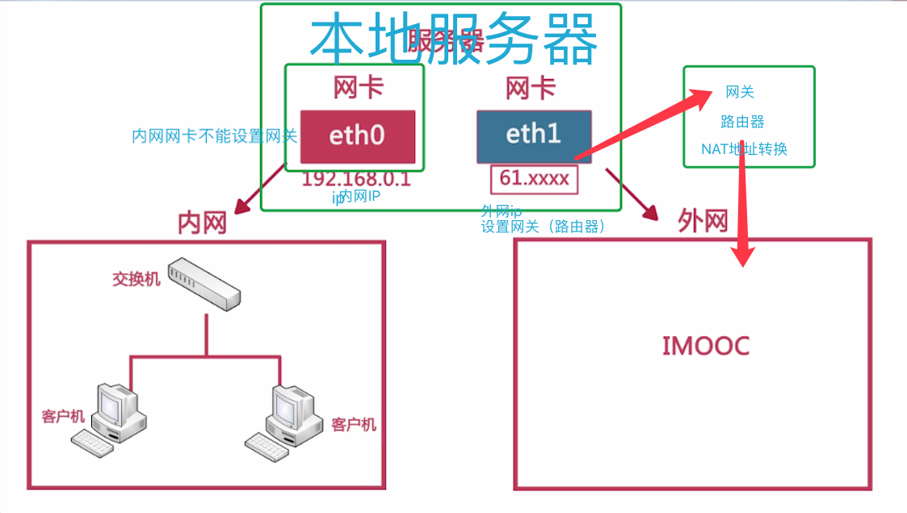

* OSI 七层框架

	```
		用户层
		表示层 
		会话层 是否向下传递 【==>硬盘】
		传输层 决定TCP 还是 UDP传输  端口
		网络层 决定双方IP地址
		数据链路层 MAC地址。。。
		物理层 比特传输
	
	```

* TCP/IP 4层模型

	```
	应用层  [用户层 表示层 会话层]
	传输层  [传输层]
	网际互联层 [网络层]
	网络接口层   [数据链路层 物理层]
	
	应用层
		http ftp DNS SMTP协议 为用户服务的
		
	传输层
		TCP UDP
	
	网际互联层
		数据加上IP地址和其他的数据以确定传输的目标
		
	网络接口层
		加入一个以太网协议头，并进行CRC编码
	```
	
	
	
	
* 子网掩码

	```
	唯一作用 ：将某个IP地址划分成网络地址和主机地址两部分
	
	子网掩码不能单独存在 必须和ip地址共存
	```
	```
	ip:172.20.0.4
	子网掩码
		1:255.255.0.0 =>11111111.11111111.00000000.00000000
			 网络地址==>172.20
			 主机地址==>0.4
		2:255.255.255.0=>11111111.11111111.11111111.00000000
			网络地址==>172.20.0
			 主机地址==>4
	```
	```
	不同子网能否通讯
	IP1：172.20.0.18
	IP2：172.20.1.12
	
	1：子网掩码都为255.255.255.0
		IP1===> 网络地址为 172.20.0
		IP2===> 网络地址为 172.20.1
		不能通讯
	
	2：子网掩码都为255.255.0.0
		IP1===> 网络地址为 172.20
		IP2===> 网络地址为 172.20
		可以通讯		
	```
	```
	如何确定子网掩码
	1）将主机数目转化为二进制来表示，总位数是N；

	2）将掩码地址全部置1，然后从后向前的将N位全部置为 0，即为子网掩码值。
	
	如欲将B类IP地址168.195.0.0划分成若干子网，每个子网内有主机700台：
	
	1)700=1010111100，该二进制为十位数，N = 10
	
	2)将子网掩码255.255.255.255从后向前的10位全部置0,即为： 11111111.11111111.11111100.00000000，也即255.255.252.0。
	
	255.255.252.0就是168.195.0.0的700台主机的子网掩码了。
	```
	```
	如何理解172.20.1.0/26
	上文中的26代表主机ID的掩码地址长度，从前往后有26位
	
	11111111.11111111.11111111.11111111
	11111111.11111111.11111111.11000000 (26位)
	
	子网掩码:255.255.255.192
	```
	```
	分配地址为：193.6.7.0/24
		那么计算得
	子网掩码 255.255.255.0 (24)
	默认网关（主机位除最后一位全置1后得到的）
		193.6.7.00000000=>193.6.7.1111110=>193.6.7.254
		
		193.6.7.0/26
		193.6.7.00(1111110)
		193.6.7.001111110
		193.6.7.63/26
		
	默认广播地址(主机位全为1)
		193.6.7.255/24
	网络地址
		ip & 子网掩码
		193.6.7.0 => 11000001.00000110.00000111.00000000
		 子网掩码   => 11111111.11111111.11111111.00000000
		 
		11000001.00000110.00000111.00000000
		11111111.11111111.11111111.00000000
		=>
		11000001.00000110.00000111.00000000
		=>
		193.6.7.0
	受限广播地址
		255.255.255.255
		
	划分子网（一般都是2的n次幂）
		划分 4个子网 [2的（2）次幂]
		193.6.7.00000000
		=>主机地址前（n）位
		193.6.7.(00)000000
		193.6.7.(01)000000
		193.6.7.(10)000000
		193.6.7.(11)000000	
		
		有效地址
			去掉主机地址全部为0 和 全部为1 的地址 
	
		
	```
	
* 配置网络配置文件
	
	```
	/etc/host.conf  配置域名服务客户端的控制文件

	/etc/hosts 配置主机名和IP地址的映射
	
	/etc/resolv.conf 域名服务客户端的配置文件，指定域名服务器的IP地址
	
	/etc/network/interfaces 用于设置网络配置信息(IP地址，子网掩码，网关IP等)

	```

	* 配置ip 
	
		 /etc/network/interfaces | /etc/network/interfaces.d
		
			```
			#网卡名称 enp0s3 静态ip
			auto enp0s3
			iface enp0s3 inet static
			address 192.168.0.1 #ip地址
			netmask  255.255.255.0#子网掩码
			gateway  192.168.0.1#网关
			```
			```
			#网卡名称 enp0s3 动态ip
			局域网有dhcp服务器
			auto enp0s3
			iface enp0s3 inet dhcp
			```
			
	* 配置dns [resolvconf 重启dns]
		
		```
		ip配置 最后增加dns配置
		dns-nameservers 223.5.5.5
		```
		```
		/etc/resolvconf/resolv.conf.d/base 
		增加
		nameserver 223.5.5.5
		```
	* 重启

		```
		/etc/init.d/networking restart
		
		或者（下面是指定启动关闭某个网卡命令）
		ifdown enp0s3    （关闭网卡enp0s3）
		ifup   enp0s3    (启动网卡enp0s3)
		sudo service network-manager restart 

		```
* NAT技术

	```
	地址转换技术 [局域网 和 外网]
	
	我的ip为 187.14.51.4
	
	191.168.255.12内网 ====> 121.12.51.23百度
	191.168.255.13内网 ====> 121.12.51.23百度
	191.168.255.14内网 ====> 121.12.51.23百度
	
	191.168.255.12 NAT 会在187.14.51.4:8001 ===>百度
	191.168.255.13 NAT 会在187.14.51.4:8002 ===>百度
	191.168.255.14 NAT 会在187.14.51.4:随机端口 ===>百度
	
	
	获取到外网数据 然后通过NAT 在转发到内部地址
	
	```
* 交换示意图

	
	
		* 客户机之间进行访问可以直接通过交换机
		* 内网网卡为什么不能设置网关

			* 客户机上网 数据 通过交换机 到达 内网网卡
			* 内部网卡不知道如何处理 要交给网关 【网关是一个虚拟地址】那样你的数据就不能发出去

		* 内部网卡 会把数据交给外部网卡处理
		* 外部网卡不知道如何处理 交给网关
		* 网关为路由器器地址
		* 通过NAT 转换地址 访问外网