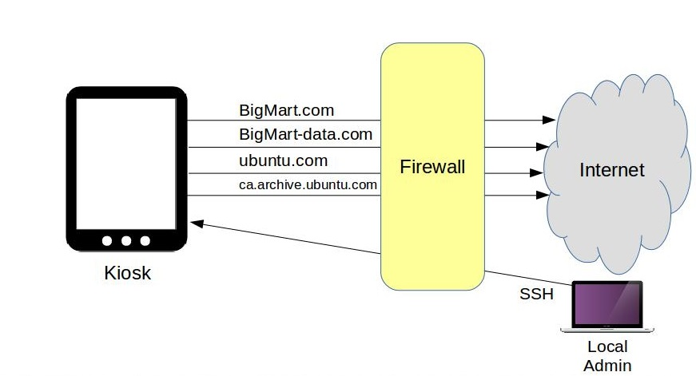

# Linux_Study

* 命令本质

	```
	ls pwd 等命令 都是指向 $PATH下某一个可执行unix可执行文件
	```
* 命令

	com [选项] [参数]
	
	```
		ls -a -l ===>ls -al
	```
* history 显示输入命令的历史记录
* ls 常看当前文件夹下的所有文件
	
	 * -a 显示所有文件
	 * -d 查看目录本身属性
	 	
	 	```
	 		ls -la ~    显示~ 目录下所有文件上属性
	 		ls -lad ~   查看~目录属性
	 	```
	 * -i 文件的i节点  ID
	 * -h 优化文件大小显示
	 * -l 显示文件详细内容

	 	```
		drwxr-xr-x  14 AA  DD      476  3 23 17:16 小东西
		-rw-r--r--@  1 AA  DD   611892  6 21 10:30 未命名.pages
		
		-rw-r--r-- 
			第一位标识文件类型
			2-5 | 3-6 | 6-9 root权限  组权限  其用户权限
			
		@ | . : ACL权限
		
		14 | 1 :  当前引用个数			
		 
		AA  : 所有者
		DD  : 所属组
		611892 : 文件大小
		3 23 17:16 : 最后一次修改时间
	 	```
	 	
	 * 参数

	 	* ls -a xx.txt 查看该文件的属性
* du 查看文件大小
	
	```
	du [选项][文件]
	```
	* -a 包含隐藏文件
	* -h 大小格式化显示  K M G	 	
	* -m -k 使用M K输出大小
	* -s 直接显示统计总和大小

	```
	du -sh 统计当前文件夹的大小
	
	du -sh com.md 
	```
	
* pwd 查看当前所在路径
	
	 	
* 文件创建命令

	* mkdir

		```
		mkdir datas
		
		mkdir -p  A/B/datas 递归创建
		```
		
		
	* cd 切换目录

		```
			cd ===> cd ~
			
			cd ../
			
			cd -  进入上次所在目录
		
		```
		
	* 删除
		
		* rmdir 删除空目录
		* rm 
			* -f 强制
			* -r 删除目录
			
			```
			rm -rf  强制删除
			```	
			
	* cp 复制
		
		* -r 复制目录
		* -p 连带文件属性一起复制
		* -d 如果是链接文件 则复制链接属性
		* -a == -pdr

	* mv 剪切

		```
		mv [源] [目标]
		
		mv a.js b.js   改名
		```
	* read 用于读取标准输入 单行 | 文件的单行

		* -a 指定接收的变量
		* -n 指定长度
		* -t 5 指定等待时间
		* -p 显示提示语
		* -s 隐藏输入
		```
		read -a name 等待输入   echo &name
		read name 0< a.txt 读取单行到name变量中		
		```
	* ln 链接

		*  ln 硬链接

			```
			一件文件的两个文件分身
				都指向一个文件
				可以单独存在（删掉一个也可以）
				
			不能跨分区
			不能针对文件夹
			只能通过i 判断 【相同的i ID】
			```

		* ln -s 软连接[符号连接]

			```
			软连接是独立的文件 拥有自己的i和内存  
			
			源文件不在 软连接无效
			
			有相同的权限
			```
	* pwd
	
		```
		查看当前工作目录
		```
		
	* cat 显示文件所有
	* head 显示文件开头几行
		
		* -n 指定行数
		* -c 指定字符数
		
	* tail 显示文件末尾10行

		* -c tail -c 10 显示最后10字节
		* -n 指定行数  -n +20 显示[20 ~]
		* tail -25 xx 最后25行
		* -f 追踪文件修改
		* -F
		 
	* let 简单的整数计算 | bc 复杂的计算

		```
		let c=1+1
		let "c = 1 + 1"
		
		10 % 3
		10 / 3
		```
	* seq 生成一个Range

		```
		seq 1 10
			1,2,3,...10
			
		seq 1 2 10
			1 3 5 7 9
			
		-w 增加0 以确保所有输出位数一样
		-s -s"\n" 指定间隔符
		-f 输出格式化
			seq -f"str%03g" 9 11
				str009
				str010
				str011
		```
	* chmod 修改权限

		* r 4 读
		* w 2 写
		* x 1 执行
			
		```
		chmod 755 ab.sh
		
		chmod -R 600 ./shs/
		```
		* 选项
			
			* -R 表明对目录以及目录下所有文件进行操作 必须有可读r 权限
				
				```
				chmod -R a=rw ./
				```
			* --reference copy某个文件的权限

				```
				 chmod --reference=./a.js  b.js
				```
		* 八进制进行权限操作

			```
			chmod 777 ./a.txt
			```
		* 符号组合
			
			```
			u 当前用户
			g 同组用户
			a 所有用户
			o 其他用户
			
			r | w | x
			
			s
			t 只有所有者才能删除文件
			
			+ 增加权限   +x
			- 移除权限  -x
			= 赋值权限  =rxw
			```
			```
			chmod g+w ./a.js  同组用户增加w
			
			chmod o= ./a.js  删除同组用户 所有权限  
			
			chmod a-w ./a.js 删除所有用户 w权限
			
			chmod u=rwx, g=rw, o=r ./test.log
			```
	* 文件操作

		* locate 文件名 搜索 【快】

			```
			locate [文件名]
				在/var/lib/mlocate 数据库搜索 【一天更新】
			updatedb 更新数据库
			
			/etc/locate.conf locate搜索配置文件
			```
		* whereis which 命令 搜索

			```
			whereis 搜索命令所在地方
				-b 查看执行文件
				-m 查看文档
			which 系统|用户 命令
				
			```
		* find 文件搜索 【慢】 [find [范围] [条件]]
			
			```
			find / -name xxx.js
			find / -name "*?.JPG"
			```
			* ! 取反 	find / ! -name "*zzh.txt"
			* -name 指定名称或者正则
			* -iname 不区分大小写

				```
				find ~ ( -iname 'jpeg' -o -iname 'jpg' ) 
				find ~ \( -iname '*jpeg' -o -iname '*jpg' \) -type f
				```
			* -regex 路径匹配正则
			* -iregex 路径匹配正则  不区分大小写
			
				```
				find ./ -regex ".*\(\.js\|\.md\)$"
				```
			* -user 指定所有者
				
				```
				find / -user zhuzihao 
				```
			* -nouser 没有所有值

				```
				find / -nouser
				```
			* -maxdepth | -mindepth

				```
				-maxdepth 3
				指定深度
				```
			* -perm 根据权限
				
				```
					-perm 755
				```
			* -type 根据类型

				```
				-type f|d\l\c\b\s\p
				```
			* -delete 删除搜索到的文件

				```
				find /  -name '.log' -delete
				```
			* -mtime  修改时间
			* -atime 访问时间
			* -ctime 改变文件属性
				```
				-10 十天内
				10 十天当前修改
				+10十天之前修改
				```
			* -size 大小

				```
				-25k 小于
				25k
				+25k 大于25k
				
				20M
				-20M
				```
				
			* -inum 通过i[i节点]搜文件

			* -a and 多个条件满足
			* -o or 或

				```
				find / -size +20k -a -size 50k
					[20-50]k文件
				```
			* "-exec [命令] {} \;" 对找到的文件进行处理
				
				```
				find ./ -size +10k -a -size -100k -exec ls -hl {} \;
				```
				
			
		* tr 对字符串进行 转换 压缩 ..
			
			```
			-d 删除
				echo abcd | tr -d "ac" ==> bd
			-s 把连续重复的字符以单独一个字符表示；
				echo "thissss is      a text linnnnnnne." | tr -s ' sn'
				吧 连续的[空格,s,n] 变为 单个[空格,s,n]
				
			
			
			echo "HELLO WORLD" | tr 'A-Z' 'a-z'
				大写转小写
			
			```
			
		* grep 文件内容 字符串搜索
		
			```
			grep [选项...] [内容|RegExp] [文件|文件夹]
			默认 显示一行
			```
			
			* -a | --text  二进制数据也要查找
			* -c 仅仅显示查找的总行数
			* -i 忽略大小写
			* -E 使用正则[不加也是可以的] grep -e zzh*+(love)$ ./a.txt
			* -n 显示行数
			* -o 仅仅把搜索到的内容显示出来
				dome.text 内容为 ABAC
				grep -i A dome.text  会显示 ABAC
				grep -io A dome.text 会显示两行 分别为两个A
 			* -d | -r 如果目标是文件夹 必须指定
			* -l  仅仅列出符合条件的文件名称
			* -v  显示 正常搜索的结果=>取反  
				* grep -v "zzh" ./a.txt 显示没有zzh的行

			```
			默认只能文件查找 
			
			grep -i -n -o "+10" xxFile
			
			grep -n -r "rxjs" ./* 该目录下[递归]
			
			grep -lr log /var/log 显示符合条件的 文件名称
			```
			
		* sort 对文件类容进行排序
			
			```
			对文件内容排序 -行为一个比较单元
			-r 倒叙
			-n 按照数字的大小
			-t 指定 分割一行字符
				-t -  使用"-"进行分割
			-k 指定分割之后比较的部分
				"ABCD-EFGH"
				-k 1 -t - 表示使用ABCD 这一部分进行排序
				-k 1.2 -t - 表示使用BCD 这一部分进行排序
				-k 1.2 1.3 -t -  表示使用BC 这一部分进行排序
				
			```
		* wc 统计文件的字节数、字数、行数

		* cut  用来显示行中的指定部分，删除文件中指定字段

			```
			zzh,98,yes
			zm,89,no
			sx,100,yes
			```
			
			* -d 字段分割符 default:TAB

				```
				cut -d , source.txt
				```
			* -f 显示指定字段部分内容

				```
				cut -d , -f  1 source.txt
				
				zzh
				zm
				sx
				```
			* -b 仅显示行中指定直接范围的内容  [字节]


			* -c：仅显示行中指定范围的字符；

				```
				cut -c1-3 a.txt 显示1-3个字符
				cut -c-2  a.txt 显示前两个字符
				cut -c5-  a.txt 显示第五个字符到结尾
				```
		
	* man 查看命令文档
		
		```
		man ls 查看ls命令文档
		
		LS(1)                     BSD General Commands Manual                    LS(1)
		
		NAME
		     ls -- list directory contents
		
		SYNOPSIS
		     ls [-ABCFGHLOPRSTUW@abcdefghiklmnopqrstuwx1] [file ...]
		
		DESCRIPTION
			.......
			-A      List all entries except for . and ...  Always set for the super-
             user.

		     -a      Include directory entries whose names begin with a dot (.).
		     
		     
		```
		
		* 命令查看

			* man ls 只能查看系统命令 【cd shell自带命令无法查看】
			* whereis ls  无执行文件的为安装命令 不是系统命令 【/bin/ls 为安装命令】
			* help cd 查看cd命令   无法查看shell 自带命名
		
	* chkconfig [学习]

	* 文件解压缩

		```
		.zip .gz .bz2 格式 解压缩
		```
		
		* .zip

			```
			压缩文件
			 zip 压缩文件名  源文件 【zip a.zip a.txt】
			  
			压缩目录
			 zip -r 压缩文件名  源目录 [zip -r images.zip images]
			 
			解压缩
				unzip xx.zip文件
			```
			
		* .gz

			```
			gzip 源文件 》压缩为.gz压缩格式  原文件消失
			
			gzip -c abc > abc.gz 压缩为.gz压缩格式 原文件存在
			
			gzip -r 目录 | 压缩目录下所有文件
			
			gzip -d aa.gz 解压
			gunzip  aa.gz
			gunzip -r images
			
			```
			
		* .bz2

			```
			bzip2 原文件 | 不保留原文件
			
			bzip2 -k 原文件 |保留元原件
			
			bzip2 -d 文件 | bunzip2 文件 解压缩
			
			不能压缩目录
			```
		
		* 【为解决上面打包文件夹不方便问题】
			
			* 1 tar  打包 
	
				```
				tar -cvf 输出文件名 原文件|文件夹
					
				tar -xvf 文件  解压
				```
		
			* 2 打包后在压缩所需格式

				```
				zip a.tar
				
				bzip2 a.tar
				```
				
			* 合并 1 2

				```
				tar -cvfz aa.tar.gz 原文件1 目录2 [打包多个] -C /x/a/
				tar -xvfz aa.tar.gz
				
				tar -cvfj aa.tar.bz2 原文件1 目录2
				tar -xvfj aa.tar.bz2			
				```
				
			```
				-c 打包
				-x 解压
				-v显示过程
				-f指定打包输出名称
				-C 指定输出路径
				-t 查看压缩包内容
			```
			
	* 关机

		shundown 选项 时间

		```
		 -h 关机
		 -r 重启
		 -c 取消上一个关机命令
		 
		 shutdown -h now
		 shutdown -r 12:00
		 shutdown -c
		 
		```
	* logout 退出登入窗口 【关闭shell】

		```
		一定记得关闭登入窗口
		```
		
	* mount 挂在外接磁盘到linux
	* umount 一定要卸载

		```
		mount [-t 文件类型  可以不指定] [-o 挂载选项] 磁盘  挂载目录
		
		mount -t iso966 -o exec,rw  /dev/sh0  /mnt/mymount
		
		mount -o 
			async 以非同步的方式执行文件系统的输入输出动作。 
			atime 每次存取都更新inode的存取时间，默认设置，取消选项为noatime。 
			auto 必须在/etc/fstab文件中指定此选项。执行-a参数时，会加载设置为auto的设备，取消选取为noauto。 
			defaults 使用默认的选项。默认选项为rw、suid、dev、exec、anto nouser与async。 
			dev 可读文件系统上的字符或块设备，取消选项为nodev。 
			exec 可执行二进制文件，取消选项为noexec。 
			noatime 每次存取时不更新inode的存取时间。 
			noauto 无法使用-a参数来加载。 
			nodev 不读文件系统上的字符或块设备。 
			noexec 无法执行二进制文件。 
			nosuid 关闭set-user-identifier(设置用户ID)与set-group-identifer(设置组ID)设置位。 
			nouser 使一位用户无法执行加载操作，默认设置。 
			remount 重新加载设备。通常用于改变设备的设置状态。 
			ro 以只读模式加载。 
			rw 以可读写模式加载。 
			suid 启动set-user-identifier(设置用户ID)与set-group-identifer(设置组ID)设置位，取消选项为nosuid。 
			sync 以同步方式执行文件系统的输入输出动作。 
			user 可以让一般用户加载设备。 
		```
		
		```
		umount -v /mnt/mymount/
		umount -vl /mnt/mymount/ 延迟卸载 
		umount: /mnt/mymount: device is busy 标识正在使用磁盘
			//可能： lsof | grep mymount 是否监听某个端口
			
			
		eject /dev/cdrom      卸载并弹出CD 
		```
		
 * lsof 列出系统一切关于文件的东西

 	 * -h 显示帮助
 	 * -t 仅仅显示进程PID
 	 * -i 显示网络信息

	 	 	```
	 	 	lsof -i 显示系统当前所有网络连接
	 	 	lsof -i 6 只显示IPV6
	 	 	lsof -i:port 显示某个端口信息
	 	 	lsof -i@ip 显示和某个ip的连接
	 	 	lsof -i@ip:port 显示和某个ip某个port的连接 
	 	 	lsof -i@ip:port1=port2 显示和某个ip某个port范围的连接 
	 	 	lsof -iUDP | -iTCP 显示UDP | UDP 信息
	 	 	lsof  -i -sTCP:LISTEN 正在等待连接的端口 [lsof -i | grep -i LISTEN]
	 	 	```
	 * -u 显示与某个用户相关的 lsof -u zzh  | ^zzh 除了zzh 其他的用户

	 		```
	 		 kill  -9  `lsof -t -u daniel` 杀死某个用户所有进程
	 		```
	 		
	 * -c 查看指定命令使用的文件

		 	```
		 	lsof -c node
		 	```
	 * -p 查看指定进程ID 打开的文件

		 	```
		 	lsof -i:8081 -t  ===>1213
		 	lsof -p 1213
		 	```
	 * 查看和 【文件 | 目录】 正在交互的进程和用户

		 	```
		 	lsof a.txt
		 	```
	 * 查看文件链接数
	
		 	```
		 	 lsof +L1 显示所有打开的链接数小于1的文件
		 	```
	 * +d 目录下被进程开启的文件 +D

		 	```
		 	lsof +d /ss/saa/ 当前目录
		 	lsof +D /ss/saa/ 递归遍历目录下
		 	```
	 * +-r [lsof 一直执行]

		 	```
		 	lsof -i:8081 -r    15s执行一次  ctrl+C
		 	lsof -i:8081 -r 5  5s执行一次 知道 ctrl+C
		 	
		 	lsof -i:8081 +r 10   一直执行 没有输出停止
		 	```
	
* w 显示当前登入用户的信息

* ps 显示系统进程信息 【默认显示当前命令窗口运行的进行】

	* -A 显示[系统]所有程序
	* -c 增加 显示 CLS 和 PRI 信息
	* c 增肌显示COMMAND  运行的命令
	* -C 显示指定命令的 运行状态

		```
		ps -C su
		```
	* -d 显示所有程序 【不包括阶段作业领导者的程序】 【-A】

	* -e == -A
	* e 列出程序时，显示每个程序所使用的环境变量
	* -f 显示UID,PPIP,C与STIME栏
	* f 用ASCII字符显示树状结构，表达程序间的相互关系。
	* -m | m 
	* -N 显示出来当前命令行 以外的进程
	* -u 指定用户
	* -j或j：采用工作控制的格式显示程序状况。
	* -l或l：采用详细的格式来显示程序状况。

	```
	ps axo pid,comm,pcpu # 查看进程的PID、名称以及CPU 占用率
	ps aux | sort -rnk 4 # 按内存资源的使用量对进程进行排序
	ps aux | sort -nk 3  # 按 CPU 资源的使用量对进程进行排序
	ps -A # 显示所有进程信息
	ps -u root # 显示指定用户信息
	ps -efL # 查看线程数
	ps -e -o "%C : %p :%z : %a"|sort -k5 -nr # 查看进程并按内存使用大小排列
	ps -ef # 显示所有进程信息，连同命令行
	ps -ef | grep ssh # ps 与grep 常用组合用法，查找特定进程
	ps -C nginx # 通过名字或命令搜索进程
	ps aux --sort=-pcpu,+pmem # CPU或者内存进行排序,-降序，+升序
	ps -f --forest -C nginx # 用树的风格显示进程的层次关系
	ps -o pid,uname,comm -C nginx # 显示一个父进程的子进程
	ps -e -o pid,uname=USERNAME,pcpu=CPU_USAGE,pmem,comm # 重定义标签
	ps -e -o pid,comm,etime # 显示进程运行的时间
	ps -aux | grep named # 查看named进程详细信息
	ps -o command -p 91730 | sed -n 2p # 通过进程id获取服务名称
	```
	
* top  显示系统进程信息

	```
	ps 获取某一时刻的系统信息
	top 展示实时的系统信息 不能显示全部进程
	```
	
	```
	q：退出 top。
	h：显示帮助文档，也就是哪些按键可以使用。按下任意键返回，按 q 回到 top 命令的主界面。
	B：大写的 B，加粗某些信息。
	f：在进程列表中添加或删除某些列。按 q 回到 top 命令的主界面。
	F：改变进程列表排序所参照的列。默认情况下，是按照 %CPU 那一列来排序，按 q 回到 top 命令的主界面。
	u：依照用户来过滤显示。可以输入用户名，按回车。
	k：结束某个进程。会让你输入要结束的进程的 PID。
	s：改变刷新页面的时间。默认的，页面每隔 3 秒刷新一次。
	```
* & nohup 进程前后台切换 
	
	[&_nohup](./linux.md)
	
* at 设置定时任务 或者重复 【前台】

* crontab

	```
	设置定时任务 
	ls -l /etc | grep cron 任务存放目录

	crond服务 【service crond start】
		/sbin/service crond start    # 启动服务
		/sbin/service crond stop     # 关闭服务
		/sbin/service crond restart  # 重启服务
		/sbin/service crond reload   # 重新载入配置
	```
	
	* -e 编辑任务
	* -l 列出用户任务
	* -r 删除该用户的计时器设置；

	```
	minute   hour   day   month   week   command     顺序：分 时 日 月 周
	
	minute： 表示分钟，可以是从0到59之间的任何整数。
	hour：表示小时，可以是从0到23之间的任何整数。
	day：表示日期，可以是从1到31之间的任何整数。
	month：表示月份，可以是从1到12之间的任何整数。
	week：表示星期几，可以是从0到7之间的任何整数，这里的0或7代表星期日。
	command：要执行的命令，可以是系统命令，也可以是自己编写的脚本文件。
	
	
	星号（*）：代表所有可能的值，例如month字段如果是星号，则表示在满足其它字段的制约条件后每月都执行该命令操作。
	逗号（,）：可以用逗号隔开的值指定一个列表范围，例如，“1,2,5,7,8,9”
	中杠（-）：可以用整数之间的中杠表示一个整数范围，例如“2-6”表示“2,3,4,5,6”
	正斜线（/）：可以用正斜线指定时间的间隔频率，例如“0-23/2”表示每两小时执行一次。同时正斜线可以和星号一起使用，例如*/10，如果用在minute字段，表示每十分钟执行一次
	```
	```
	每1分钟执行一次command
	* * * * * command
	
	每小时的第3和第15分钟执行
	3,15 * * * * command
	
	在上午8点到11点的第3和第15分钟执行
	3,15 8-11 * * * command
	
	每隔两天的上午8点到11点的第3和第15分钟执行
	3,15 8-11 */2 * * command
	```
* SSH 非对称加密

	```
	我                                他
	私钥[仅仅解密]  -----------------> 公钥[仅仅加密]
	
	解密得到秘钥  <------------------- 秘钥 加密
	
	通讯 <------------秘钥----------------->通讯
	
	
	```
	
	* scp 远程拷贝

	* ftp | sftp 文件传输
	
	* rsync 同步备份 【同步一台电脑和多台电脑两个文件夹的内容】

* ifconfig 查看 配置网卡信息

	```
	add<地址>：设置网络设备IPv6的ip地址；
	del<地址>：删除网络设备IPv6的IP地址；
	down：关闭指定的网络设备；
	up：启动指定的网络设备；
	<hw<网络设备类型><硬件地址>：设置网络设备的类型与硬件地址；

	mtu<字节>：设置网络设备的MTU；
	netmask<子网掩码>：设置网络设备的子网掩码；
	tunnel<地址>：建立IPv4与IPv6之间的隧道通信地址；
	
	broadcast<地址>：将要送往指定地址的数据包当成广播数据包来处理；
	网络设备：指定网络设备的名称。
	```
	```
	ifconfig 查看激活网卡
	ifconfig eth0 查看指定网卡
	ifconfig -a 查看所有网卡
	ifconfig eth0 up|down 开启关闭eth0网卡
	ifconfig eth0 192.168.120.56 netmask 255.255.255.0 broadcast 192.168.120.255
		eth0 ip
		子网掩码 
		广播地址
	ifconfig eth0 hw ether 00:AA:BB:CC:dd:EE 设置MAC地址 
	ifconfig eth0 add 33ffe:3240:800:1005::2/64  #为网卡eth0配置IPv6地址
	
	单网卡添加多个子网卡 IP地址
		ifconfig eth0:0 192.168.1.100 netmask 255.255.255.0 up
	 	ifconfig eth0:1 192.168.2.100 netmask 255.255.255.0 up
	 	[重启失效]。[修改网络配置文件]
	 	
	 ifconfig eth0 mtu 1500 #设置能通过的最大数据包大小为 1500 bytes
	```
	
* netstat 查看网络状况

	```
	-a 查看所有Socket
	-u 查看UDP
	-t 查看TCP
	-c 持续查看  打印
	-i 显示网络界面信息表单 网卡信息
	-l 显示Listen状态的 socket
	-n 直接显示ip地址
	-s 显示统计信息
	-p 增加一项输出   PID/Program name
	```
	```
	netstat -tuln
	
	netstat -rn 网络信息（dns 网关。。。）
	```

* iptables

	* 基本参数
	
		```
		-P	设置默认策略:iptables -P INPUT (DROP
		-F	清空规则链
		-L	查看规则链
		-A	在规则链的末尾加入新规则
		-I	num 在规则链的头部加入新规则
		-D	num 删除某一条规则
		-s	匹配来源地址IP/MASK，加叹号"!"表示除这个IP外。
		-d	匹配目标地址
		-i	网卡名称 匹配从这块网卡流入的数据
		-o	网卡名称 匹配从这块网卡流出的数据
		-p	匹配协议,如tcp,udp,icmp
		-j 指定规则采取的动作
		--dport num	匹配目标端口号
		--sport num	匹配来源端口号
		```
	* 规则链
	
		```
		INPUT链 ：处理输入数据包。
		OUTPUT链 ：处理输出数据包。
		FORWARD链 ：处理转发数据包。
		PREROUTING链 ：用于目标地址转换（DNAT）。将内部服务 公开到 外部网络
		POSTROUTING链 ：用于源地址转换（SNAT）。代理内部客户访问外部网络
		```
	* 表名
		
		```
		raw ：高级功能，如：网址过滤。
		mangle ：数据包修改（QOS），用于实现服务质量。
		nat ：地址转换，用于网关路由器。
		filter ：包过滤，用于防火墙规则。
		```
		
		```
		filter 定义允许或者不允许的，只能做在3个链上：INPUT ，FORWARD ，OUTPUT
		nat 定义地址转换的，也只能做在3个链上：PREROUTING ，OUTPUT ，POSTROUTING
		mangle功能:修改报文原数据，是5个链都可以做：PREROUTING，INPUT，FORWARD，OUTPUT，POSTROUTING	
		```
	* 动作
	
		```
		ACCEPT ：接收数据包。
		DROP ：丢弃数据包。
		REDIRECT ：重定向、映射、透明代理。
		SNAT ：源地址转换。代理内部客户访问外部网络
		DNAT ：目标地址转换。将内部服务 公开到 外部网络
		MASQUERADE ：IP伪装（NAT），用于ADSL。
		LOG ：日志记录。
		```
		
  	*	 匹配顺序
	
		```
		A
		B
		C
		
		发起baidu.com 请求 会依次匹配ABC 如果某一个匹配上 就会执行[容许|阻止] 停止匹配链。	
		```
 	* 设置规则

		 ```
		 iptables -t 表名 <-A/I/D/R> 规则链名 [规则号] <-i/o 网卡名> -p 协议名 <-s 源IP/源子网> --sport 源端口 <-d 目标IP/目标子网> --dport 目标端口 -j 动作
		 ```
	 
	* 常见命令

		```
		iptables -L -n --line-numbers 会显示规则的序号
		
		iptables -D INPUT 8 删除INPUT序号为8的规则
		
		iptables -A INPUT -s 192.168.1.5 -j DROP
				-A 在末尾追加
				INPUT 表明是 接受访问
				-s 指明 ip 192.168.1.5
				-j DROP 禁止
			禁止ip端的ip 访问这台电脑
			
		iptables -t nat -A POSTROUTING -s 192.168.188.0/24 -j SNAT --to-source 210.14.67.127
			-t nat 增加到nat[转发表]
			-A 加到最后
			POSTROUTING 源地址转换
			-s 192.168.188.0/24 指定端口
			-j SNAT --to-source 210.14.67.127  源地址转换
			
		 	内网192.168.188.0/24能连接到公网210.14.67.7
		 	
		iptables -t nat -A PREROUTING -d 192.168.10.88 -p tcp --dport 80 -j DNAT --to-destination 192.168.10.88:8080
		iptables -t nat -A PREROUTING -p tcp --dport 80 -j REDIRECT --to-ports 8080
		
			1：来自192.168.10.88的访问80端口映射到8080端口
			2：所有的访问 80端口映射到8080端口
			
		iptables -t nat -A OUTPUT -p tcp -d 127.0.0.1 --dport 80 -j DNAT --to 127.0.0.1:8080
			将本机访问80端口的转发到本机8080
			回环地址 只经过OUTPUT 不会通过 PREROUTING
			
		```
	* 一个使用场景

		```
		#!/bin/bash
		iptables -A OUTPUT -p tcp -d bigmart.com -j ACCEPT
		iptables -A OUTPUT -p tcp -d bigmart-data.com -j ACCEPT
		iptables -A OUTPUT -p tcp -d ubuntu.com -j ACCEPT
		iptables -A OUTPUT -p tcp -d ca.archive.ubuntu.com -j ACCEPT
		iptables -A OUTPUT -p tcp --dport 80 -j DROP
		iptables -A OUTPUT -p tcp --dport 443 -j DROP
		iptables -A INPUT -p tcp -s 10.0.3.1 --dport 22 -j ACCEPT
		iptables -A INPUT -p tcp -s 0.0.0.0/0 --dport 22 -j DROP
		```
		```
		仅仅容许访问
			bigmart.com
			bigmart-data.com
			ubuntu.com
			ca.archive.ubuntu.com 
			
		其他任何80[http] 443[https]的访问都会被拒绝
		
		容许 10.0.3.1:22 的input连接
		
		不容许0.0.0.0/0的访问
		```
		